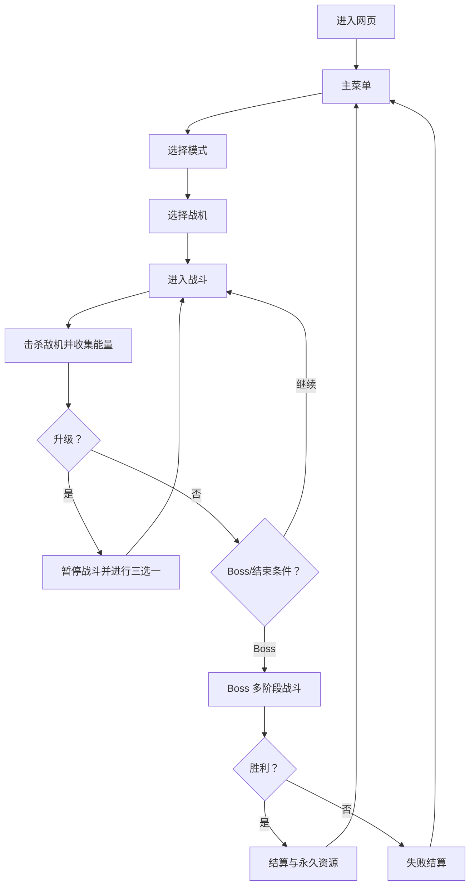

# 《星渊突击》网页飞机大战

> Solo Builder 产品与技术实现文档 · v0.1  
> 文档状态：可评审草案  
> 目标平台：桌面端与移动端现代浏览器  
> 核心方向：经典纵版射击 × Roguelite 构筑 × 多阶段巨型 Boss × 霓虹科幻

---

## 0. 给 Builder 的一句话任务

制作一款可直接在浏览器运行的单页纵版飞机射击游戏：玩家控制战机自动射击，在 8 分钟一局的战斗中击败敌机、收集能量、通过“三选一”升级形成武器流派，最终挑战拥有 3 个阶段的巨型 Boss；首版必须包含战役、Boss 挑战和无尽 3 种模式，并兼容鼠标、键盘和手机触控。

## 1. 项目定位

### 1.1 游戏名

- 中文名：星渊突击
- 英文名：NEON ABYSS: AIR STRIKE
- 内部代号：Project Starfall

### 1.2 产品体验

玩家应在前 10 秒理解操作，在前 30 秒获得第一次升级，在 3 分钟内形成明显的武器流派，并在结算时产生“再来一局换一种构筑”的动力。

### 1.3 核心卖点

1. 单指/单鼠标即可玩的低门槛纵版射击。
2. 每局随机“三选一”升级，支持激光、导弹、无人机、闪电等构筑。
3. 巨型 Boss 占据约半屏，拥有部位破坏、弹幕预警、阶段转换和狂暴机制。
4. 霓虹科技风界面、粒子爆炸、屏幕震动、击杀连击与清晰音效反馈。
5. 战役、Boss 挑战、无尽三种模式共享同一套战斗系统。

### 1.4 非目标

首版不做以下内容：

- 联机、PvP、排行榜后端、账号系统。
- 付费、广告、抽卡、体力系统。
- 复杂剧情、对话树、开放世界或多人合作。
- 写实军事题材和真实军机授权。
- 依赖服务端才能开始游戏的功能。

## 2. 市场玩法提炼

本项目只借鉴成熟的玩法结构，不复制任何现有产品的角色、飞机造型、关卡、美术、数值、文案或音频。

| 玩法来源 | 可验证的成熟机制 | 本项目的转化 |
|---|---|---|
| 经典纵版射击 | 滚屏关卡、弹幕躲避、巨型 Boss、不同战机、难度递进 | 自动射击、波次推进、Boss 分阶段、清晰判定点 |
| 《Sky Force Reloaded》 | 关卡任务、飞机与装备升级、收藏、巨型 Boss、无尽挑战 | 保留关卡目标和永久强化，但首版压缩为轻量本地存档 |
| 《1945 Air Force》 | 战役、Boss 战、多种模式、飞机升级；Google Play 页面显示 100M+ 下载，说明经典射击与现代成长结合仍有广泛用户基础 | 做战役、Boss 挑战、无尽三模式，但不做复杂活动与多货币 |
| 《Wing Fighter》 | 多 Boss、装备、战斗 Buff、Roguelike 天赋、无尽模式 | 局内三选一与武器协同，不照搬其装备经济 |
| 《Vampire Survivors》类 | 自动攻击、拾取经验、局内升级、局外轻成长、短局重复游玩 | 玩家专注走位，升级决定火力方向；永久强化只提供轻量辅助 |

参考资料：

- [Sky Force Reloaded 官方 Steam 页面](https://store.steampowered.com/app/667600/Sky_Force_Reloaded/)
- [1945 Air Force 官方 Google Play 页面](https://play.google.com/store/apps/details?id=com.os.airforce)
- [Wing Fighter 官方 App Store 页面](https://apps.apple.com/id/app/wing-fighter/id1562065271)
- [Vampire Survivors 官方 Steam 页面](https://store.steampowered.com/app/1794680/Vampire_Survivors/)

## 3. 目标用户与设计原则

### 3.1 目标用户

- 喜欢飞机大战、街机射击、弹幕躲避的玩家。
- 喜欢短局 Roguelite 构筑，但不想学习复杂系统的休闲玩家。
- 使用电脑浏览器或手机浏览器，希望点开即玩的用户。

### 3.2 设计原则

- 先好玩，后复杂：移动、射击、命中反馈必须优先于外围系统。
- 难而不阴：致命攻击必须有预警，失败应源于判断而非看不见。
- 每次升级都能被感知：弹道、数量、颜色、音效或范围必须明显变化。
- 一局一流派：升级选择应促使玩家聚焦 1—2 个主要武器。
- 小判定，大演出：玩家碰撞核心小于飞机视觉尺寸，减少挫败。
- 首版可完整闭环：无登录、无联网也能完成开始—战斗—结算—成长—再开一局。

## 4. 用户流程



## 5. 页面与信息架构

游戏是单页应用，不刷新页面完成所有流程。

### 5.1 页面状态

1. 启动页：Logo、资源加载进度、首次音频授权提示。
2. 主菜单：开始游戏、模式选择入口、机库、设置、最高纪录。
3. 模式选择：战役、Boss 挑战、无尽。
4. 战机选择：首版 3 架战机，展示基础属性与特性。
5. 战斗页：Canvas 游戏区 + HUD。
6. 升级弹窗：3 张升级卡，可重抽 1 次。
7. 暂停页：继续、设置、重新开始、返回主菜单。
8. 结算页：胜负、分数、时长、击杀、构筑、获得星核、再来一局。
9. 机库页：查看战机、永久升级。
10. 设置页：音量、画质、屏幕震动、伤害数字、控制方式。

### 5.2 主菜单视觉

- 背景：缓慢移动的深空、网格地平线、远处舰队剪影。
- 中央：玩家主战机悬浮，带呼吸光和轻微左右摆动。
- Logo：上方居中，使用锐利切角字形与青色发光边缘。
- 主按钮：“开始作战”，使用青色到蓝色渐变，悬停时边框流光。
- 次级入口：模式、机库、设置，使用深色半透明玻璃面板。
- 右上角：本地星核数量与最高分。
- 左下角：版本号 `v0.1.0`。

## 6. 屏幕、比例与响应式规则

### 6.1 游戏逻辑尺寸

- 固定逻辑画布：`720 × 1280`，纵向 9:16。
- Phaser 缩放模式：`FIT`，自动居中。
- 游戏区不可因浏览器尺寸变化而改变世界坐标。
- 画布外围用动态星空、雷达网格和装饰面板填充，不能出现纯黑空白。

### 6.2 桌面端

- 画布高度不超过视口高度。
- 当视口足够宽时，画布左侧显示任务/操作提示，右侧显示构筑和模式信息。
- 两侧面板只是 DOM 装饰与信息，不影响核心操作。

### 6.3 移动端

- 画布铺满可用区域并尊重安全区 `env(safe-area-inset-*)`。
- 禁止双指缩放和页面滚动。
- 一根手指拖动战机；触点不必落在战机上。
- “终极技能”和“暂停”按钮要避开玩家常用拖动区域。
- 触控按钮最小可点击尺寸 48 CSS px。

## 7. 核心玩法

### 7.1 操作

| 平台 | 移动 | 终极技能 | 暂停 |
|---|---|---|---|
| 键盘 | WASD / 方向键 | Space | Esc / P |
| 鼠标 | 按住左键拖动或直接跟随指针 | 右键或屏幕按钮 | Esc |
| 触控 | 单指拖动 | 右下角技能按钮 | 右上角暂停按钮 |

规则：

- 主武器自动射击。
- 键盘移动需要加速度与减速度，避免瞬移感。
- 指针移动采用轻微插值，不直接硬吸附。
- 玩家不可离开安全边界。
- 浏览器失焦时自动暂停。

### 7.2 玩家基础属性

```ts
interface PlayerStats {
  maxHp: number;          // 默认 100
  moveSpeed: number;      // 默认 420 逻辑像素/秒
  damage: number;         // 主炮单发基础伤害 12
  fireRate: number;       // 默认 5 发/秒
  critChance: number;     // 默认 5%
  critMultiplier: number; // 默认 1.75
  pickupRadius: number;   // 默认 90
  invulnerableMs: number; // 受击后默认 800ms
}
```

- 玩家视觉尺寸约 `74 × 92`。
- 玩家碰撞判定为中心半径 `12` 的圆。
- 受击后短暂无敌，闪烁但不得完全消失。
- HP 归零后触发 900ms 爆炸演出，再进入结算。

### 7.3 基础战斗循环

1. 敌人按时间轴和强度预算生成。
2. 玩家自动攻击，移动躲避敌弹和碰撞。
3. 敌人死亡掉落经验能量，精英额外掉落修复包或增幅模块。
4. 经验达到阈值后暂停世界，出现三选一升级。
5. 升级强化或改变弹道，形成构筑。
6. 战役时间达到 6:30 后清场并进入 Boss。
7. 击败 Boss 或玩家阵亡，进入结算。

### 7.4 经验与升级

升级经验需求：

```ts
function xpToNextLevel(level: number): number {
  return Math.floor(30 + level * 18 + Math.pow(level, 1.35) * 4);
}
```

掉落：

- 普通敌人：1 个小型能量，价值 5 XP。
- 中型敌人：1 个中型能量，价值 15 XP。
- 精英敌人：3 个中型能量 + 20% 概率掉修复包。
- Boss 部位破坏：大型能量，价值 80 XP；Boss 战中升级时照常暂停。

升级规则：

- 每次展示 3 个不重复选项。
- 至少 1 个选项来自玩家已持有的武器或被动。
- 已满级项目不再出现。
- 本局有 1 次免费重抽。
- 获得新武器时立即产生明显演示效果。
- 升级界面必须显示当前等级、升级后变化和标签。

## 8. 战机

首版提供 3 架原创战机，不使用现实军机名称或外形。

| 战机 | 定位 | 属性 | 固有特性 |
|---|---|---|---|
| 曙光-7 | 均衡 | 100 HP，标准速度 | 连续 20 次命中后，伤害提高 12%，中断 2 秒后清零 |
| 幻影-X | 高机动 | 80 HP，移动速度 +15% | 每 6 秒获得 1 次擦弹护盾，可抵消 1 枚子弹 |
| 堡垒-Ω | 生存 | 140 HP，移动速度 -10% | 受到的伤害 -15%，修复包效果 +30% |

解锁：

- 曙光-7：默认。
- 幻影-X：任意模式存活 5 分钟。
- 堡垒-Ω：首次击败战役 Boss。

## 9. 武器、被动与构筑

### 9.1 武器槽位

- 1 个主武器：固定为脉冲机炮，可升级。
- 最多 3 个副武器。
- 最多 3 个被动模块。
- 每项最高 5 级。

### 9.2 武器清单

| 武器 | 核心行为 | 关键升级 | 终阶效果 |
|---|---|---|---|
| 脉冲机炮 | 向前快速射击 | 双发、穿透、暴击、攻速 | 过载：每第 10 发变为贯穿光束 |
| 等离子激光 | 持续直线伤害 | 宽度、伤害、持续、分叉 | 折射：命中后连接附近 2 个目标 |
| 追踪导弹 | 锁定高威胁目标 | 数量、爆炸范围、冷却 | 分裂：爆炸后生成 4 枚微型导弹 |
| 护航无人机 | 两侧自动射击 | 数量、攻速、角度、伤害 | 同步：终极技能期间复制玩家主炮 |
| 电弧链 | 自动攻击最近敌人 | 跳跃数、伤害、麻痹、范围 | 雷暴：每 8 秒产生全屏连锁闪电 |
| 旋刃力场 | 环绕战机伤害近敌 | 数量、尺寸、转速、击退 | 磁暴：旋刃可消除部分小型敌弹 |

### 9.3 被动模块

| 模块 | 效果 |
|---|---|
| 火控核心 | 全部伤害 +8%/级 |
| 超频引擎 | 射速 +7%/级 |
| 相位推进器 | 移速 +6%/级，最高级附带 3% 闪避 |
| 能量磁环 | 拾取半径 +25%/级 |
| 纳米装甲 | 最大 HP +12%/级，并按增加量治疗 |
| 幸运协议 | 暴击率 +4%/级，掉落率小幅提升 |

### 9.4 推荐构筑协同

- 激光矩阵：等离子激光 + 火控核心 + 超频引擎。
- 蜂群轰炸：追踪导弹 + 护航无人机 + 幸运协议。
- 近身磁暴：旋刃力场 + 电弧链 + 纳米装甲。
- 主炮过载：脉冲机炮 + 超频引擎 + 火控核心。

协同只通过机制自然形成，首版不增加额外套装 UI。

## 10. 终极技能

名称：星核超载。

- 击杀和擦弹填充能量，最大值 100。
- 普通击杀 +1，精英 +8，擦弹 +2，Boss 部位破坏 +20。
- 激活后持续 6 秒：
  - 玩家无敌。
  - 全局时间减速到 85%，玩家不减速。
  - 全部武器射速 +60%。
  - 清除屏幕上的小型敌弹，但不清除 Boss 激光。
- 结束时产生一次环形冲击波。
- 能量未满时点击按钮，只播放短促“未就绪”反馈，不打断操作。

## 11. 敌人系统

### 11.1 普通敌人

| 敌人 | 行为 | 作用 |
|---|---|---|
| 蜂刺侦察机 | 直线俯冲，单发射击 | 教学与填充 |
| 刃翼截击机 | S 形移动，三连射 | 迫使横向移动 |
| 磁轨炮艇 | 停留瞄准，显示红色射线后射击 | 教会观察预警 |
| 孢子母舰 | 缓慢移动，周期生成小型机 | 目标优先级选择 |
| 护盾无人机 | 给附近敌人提供减伤 | 促使先杀辅助 |
| 自爆机 | 锁定后冲刺，红色闪烁 | 近距离压迫 |

### 11.2 精英敌人

普通敌人可获得 1—2 个精英词缀：

- 护盾：有可恢复能量盾。
- 分裂：死亡后生成 2 个小型单位。
- 狂热：半血后攻速提高。
- 磁场：周期性吸引玩家，必须有范围预警。

精英单位使用紫色轮廓、顶部小血条和明显出现音效。

### 11.3 子弹与危险规则

- 玩家子弹：青色/白色为主。
- 普通敌弹：橙色。
- 高伤敌弹：洋红色。
- 可消除小型弹：实心圆弹。
- 不可消除攻击：激光、地面警戒区，统一使用斜纹或核心高亮。
- 任何造成 25 点以上伤害的攻击，至少提前 600ms 预警。
- 同屏敌弹软上限 260，超过时推迟非关键弹幕，不直接删除玩家身边子弹。

## 12. 关卡与模式

### 12.1 战役模式：裂隙突围

一局目标时长约 8 分钟。

| 时间 | 内容 |
|---|---|
| 00:00—00:30 | 低压教学波，直线敌机 |
| 00:30—01:30 | 引入 S 形敌机和第一次升级 |
| 01:30—02:30 | 引入瞄准炮艇 |
| 02:30—03:30 | 第一次精英事件 |
| 03:30—04:30 | 敌人组合与环境危险区 |
| 04:30—05:30 | 孢子母舰 + 护盾无人机 |
| 05:30—06:20 | 高压混合波，出现第二只精英 |
| 06:20—06:30 | 清场、Boss 警报、补给 |
| 06:30—08:00 | 巨型 Boss；实际时长随玩家输出浮动 |

胜利条件：击败 Boss。  
失败条件：玩家 HP 归零。  
难度应允许首次玩家约 2—4 局通关。

### 12.2 Boss 挑战：猎杀协议

- 完成一次战役后解锁。
- 进入前直接选择 6 次升级，快速组成初始构筑。
- 只进行 Boss 战。
- Boss 伤害 +15%，攻击间隔 -10%。
- 记录最短通关时间和剩余 HP。

### 12.3 无尽模式：深空回响

- 战役通关后解锁。
- 敌人强度每 60 秒提高一次。
- 每 4 分钟出现一只精英首领，每 8 分钟出现一次 Boss。
- 12 分钟后启动“虚空风暴”：敌人数量不再提高，移速与伤害持续增加。
- 记录最高分、最高等级和存活时间。

## 13. 巨型 Boss 设计

### 13.1 Boss 概念

- 名称：裂渊泰坦
- 外观：不对称黑色机械巨舰，紫红裂隙核心，左右各有可破坏炮台。
- 屏幕占比：出现时宽度约为画布的 78%。
- 基础 HP：战役 18,000；Boss 挑战 23,000。
- 部位：左炮台、右炮台、中央核心。
- 炮台被破坏后，对应攻击不再出现，并对主体造成 8% 最大 HP 的伤害。
- 主体伤害倍率：核心关闭时 0.65；核心开启时 1.25。

### 13.2 出场

1. 普通敌人撤离，背景速度降低。
2. HUD 出现红色“高能反应”警报，持续 2 秒。
3. Boss 从屏幕上方进入并造成镜头震动。
4. 显示名称、总血条和阶段标记。
5. Boss 完成定位后才可造成碰撞伤害。

### 13.3 阶段一：外层武装（100%—70%）

攻击：

- 扇形弹幕：左右炮台交替发射 7 发扇形弹，间隔 1.2 秒。
- 瞄准齐射：锁定玩家当前位置，3 条红线预警 700ms 后射击。
- 无人机群：每 10 秒释放 4 架蜂刺机。

策略：

- 鼓励优先破坏一侧炮台，制造安全区。
- 攻击密度中等，重点是理解部位破坏。

### 13.4 阶段二：裂隙核心（70%—35%）

阶段转换：

- Boss 短暂无敌 1.2 秒。
- 外甲展开，核心暴露。
- 清除已有小型敌弹，播放冲击波和阶段标题。

攻击：

- 旋转激光：两条激光先以细线预览 900ms，再缓慢旋转 140°。
- 螺旋弹幕：核心连续发射双色螺旋弹，持续 4 秒。
- 重力井：在玩家附近生成吸引区域，1 秒预警，持续 3 秒。

策略：

- 旋转激光不可被终极技能清除。
- 弹幕必须留出至少一条宽 80 逻辑像素的可读通道。

### 13.5 阶段三：过载狂暴（35%—0%）

阶段转换：

- 背景变为红紫色，音乐增加高频节奏层。
- Boss 断裂一侧装甲，核心持续暴露。
- Boss 攻速提高 18%，但承伤倍率固定为 1.25。

攻击：

- 交叉扫射：左右两条激光交替扫屏。
- 弹幕雨：从顶部生成 5 列下落弹，列间存在动态缺口。
- 冲撞：Boss 向玩家所在横向位置俯冲，地面箭头预警 900ms。
- 终末过载：阶段开始 45 秒仍未击败时，每 8 秒增加 5% 攻速。

胜利演出：

1. Boss 停火并出现多点连续爆炸。
2. 时间减速到 35%，核心裂开。
3. 玩家战机自动拉升穿过爆炸。
4. 画面闪白不超过 120ms。
5. 显示“任务完成”，随后结算。

## 14. 难度与数值

### 14.1 敌人强度预算

使用时间驱动的预算生成敌人，不完全依赖固定脚本。

```ts
intensity = 1 + elapsedSeconds / 75;
spawnBudgetPerSecond = 5 + intensity * 2.4;
enemyHpMultiplier = 1 + elapsedSeconds * 0.0035;
enemyDamageMultiplier = 1 + elapsedSeconds * 0.0018;
```

每种敌人有 `spawnCost`，例如普通机 3、炮艇 7、母舰 14、精英 24。生成器在预算允许时从当前时间段的敌人池中选择组合。

### 14.2 动态辅助

只做轻量、不可见的挫败保护：

- 玩家 HP 低于 30% 时，修复包掉率从基础值提升 50%，最多触发 2 次。
- 连续 20 秒未升级时，能量掉落吸附速度提高。
- 不降低 Boss HP，不在结算中标记玩家。

### 14.3 分数

```ts
score =
  killScore
  + bossPartScore
  + grazeScore
  + timeBonus
  + remainingHpBonus
  * comboMultiplier;
```

连击规则：

- 击杀后 2.5 秒内再次击杀可续连。
- 连击倍率每 10 连击 +0.1，最高 ×3。
- 受击会减少 30% 连击数，不直接清零。

## 15. 局外成长与本地存档

货币：星核，只通过完成战斗获得。

永久升级限制为 5 条，避免首版变成复杂养成：

| 升级 | 每级效果 | 上限 |
|---|---|---|
| 舰体强化 | 初始最大 HP +3% | 10 |
| 火力校准 | 初始伤害 +2% | 10 |
| 能量回收 | 星核获得 +3% | 10 |
| 紧急修复 | 每局首次低于 20% HP 时恢复 10 HP | 5 |
| 战术重构 | 每局额外 +1 次重抽 | 2 |

本地存档键：`starfall_save_v1`

```ts
interface SaveDataV1 {
  version: 1;
  starCores: number;
  unlockedShips: string[];
  permanentUpgrades: Record<string, number>;
  settings: {
    musicVolume: number;
    sfxVolume: number;
    screenShake: boolean;
    damageNumbers: boolean;
    quality: "low" | "high";
    controlMode: "auto" | "drag" | "pointer";
  };
  records: {
    campaignWins: number;
    endlessBestSeconds: number;
    endlessBestScore: number;
    bossRushBestMs: number | null;
  };
  seenTutorial: boolean;
}
```

要求：

- 存档读取失败时回退到默认值，不让游戏崩溃。
- 每次战斗结束、购买永久升级、修改设置后保存。
- 提供“重置存档”按钮，并进行二次确认。

## 16. 视觉规范

### 16.1 风格关键词

`深空`、`全息界面`、`霓虹能量`、`高对比轮廓`、`军用雷达`、`未来工业`。

避免：

- 卡通 Q 版、蒸汽朋克、写实二战、赛博朋克城市街景。
- 大面积纯黑、低对比敌弹、过度模糊、遮挡判定区的爆炸。
- 直接使用现成游戏截图、Logo 或飞机轮廓。

### 16.2 色板

```css
:root {
  --space-950: #030712;
  --space-900: #07111f;
  --panel: rgba(8, 22, 40, 0.78);
  --cyan: #2df4ff;
  --blue: #3478ff;
  --violet: #9b5cff;
  --magenta: #ff3dbb;
  --danger: #ff4d6d;
  --warning: #ffbd3e;
  --success: #43ff9a;
  --text-main: #eefaff;
  --text-muted: #7fa7ba;
}
```

### 16.3 UI 规则

- 面板使用半透明深蓝底、1px 青色描边、轻微背景模糊。
- 卡片与按钮使用 8—12px 切角或小圆角，不用胶囊形大圆角。
- 标题字重 700—800，正文 400—500。
- 数值使用等宽字体回退：`"JetBrains Mono", "Roboto Mono", monospace`。
- 中文界面字体回退：`"Noto Sans SC", "Microsoft YaHei", sans-serif`。
- 不依赖远程字体，避免首次加载阻塞。
- 正文与背景对比度至少 4.5:1。

### 16.4 战斗特效

- 命中：8—12 个短寿命火花 + 目标 60ms 高亮。
- 暴击：更大伤害数字、短促音效、洋红色十字闪光。
- 爆炸：核心闪光、碎片、烟雾三层组合。
- 拾取：能量沿曲线吸入玩家，接触时出现小型环形波。
- 升级：世界降速后冻结，HUD 向外淡出，卡片从下方进入。
- Boss 阶段转换：清弹冲击波、镜头震动、背景色相改变。
- 屏幕震动默认幅度小于 0.008，Boss 爆炸最大 0.018。

### 16.5 首版资产策略

为保证 Builder 能独立完成：

- 战机、敌机、子弹、图标优先使用代码生成的 SVG 或 Phaser Graphics。
- 背景使用程序化星空、网格、星云渐变和少量粒子。
- 音效可用 Web Audio API 合成临时版本。
- 所有资源都放在仓库内，不能运行时依赖不稳定的第三方图片链接。
- 后续可将占位 SVG 替换为原创精灵图，代码接口保持不变。

## 17. 音频

音频分层：

- BGM：菜单、普通战斗、Boss 三条循环音乐。
- SFX：玩家射击、不同副武器、命中、爆炸、受击、升级、按钮、警报、Boss 转阶段、胜利。

规则：

- 首次用户交互后再启动 Web Audio，避免浏览器自动播放限制。
- 高频射击音效必须限频或合并，避免声音爆裂。
- BGM 与 SFX 分别控制音量，默认 BGM 0.45、SFX 0.65。
- 页面失焦时暂停或降低音量，回到页面不重复创建音乐实例。
- 必须提供静音按钮。

## 18. 技术方案

### 18.1 推荐技术栈

- TypeScript
- Vite
- Phaser `3.90.0`
- HTML + CSS 负责网页外框与辅助面板
- Phaser Canvas/WebGL 负责游戏世界与战斗内 HUD
- localStorage 负责本地存档
- Vitest 负责纯逻辑单元测试

选择 Phaser 3.90.0 的原因：版本稳定、文档和范例完整，官方已发布对应 API 文档；本项目不使用仍快速变化的新主版本能力。

参考：

- [Phaser 3.90.0 官方发布说明](https://phaser.io/news/2025/05/phaser-v390-released)
- [Phaser 3.90.0 官方 API 文档](https://docs.phaser.io/api-documentation/3.90.0/api-documentation)

### 18.2 不使用 React

首版界面状态较少，Phaser Scene + 少量 DOM 足够。避免引入 React 与 Phaser 双状态源，降低 Builder 生成代码后的调试成本。

### 18.3 项目目录

```text
/
├─ index.html
├─ package.json
├─ vite.config.ts
├─ tsconfig.json
├─ src/
│  ├─ main.ts
│  ├─ styles.css
│  ├─ game/
│  │  ├─ config.ts
│  │  ├─ events.ts
│  │  ├─ scenes/
│  │  │  ├─ BootScene.ts
│  │  │  ├─ MenuScene.ts
│  │  │  ├─ HangarScene.ts
│  │  │  ├─ GameScene.ts
│  │  │  └─ ResultScene.ts
│  │  ├─ entities/
│  │  │  ├─ Player.ts
│  │  │  ├─ Enemy.ts
│  │  │  ├─ Boss.ts
│  │  │  ├─ Projectile.ts
│  │  │  └─ Pickup.ts
│  │  ├─ systems/
│  │  │  ├─ InputSystem.ts
│  │  │  ├─ SpawnDirector.ts
│  │  │  ├─ WeaponSystem.ts
│  │  │  ├─ UpgradeSystem.ts
│  │  │  ├─ CollisionSystem.ts
│  │  │  ├─ BossPatternSystem.ts
│  │  │  ├─ ScoreSystem.ts
│  │  │  ├─ AudioSystem.ts
│  │  │  ├─ PoolSystem.ts
│  │  │  └─ SaveSystem.ts
│  │  ├─ ui/
│  │  │  ├─ Hud.ts
│  │  │  ├─ UpgradeOverlay.ts
│  │  │  ├─ PauseOverlay.ts
│  │  │  └─ BossHealthBar.ts
│  │  ├─ data/
│  │  │  ├─ ships.ts
│  │  │  ├─ enemies.ts
│  │  │  ├─ weapons.ts
│  │  │  ├─ upgrades.ts
│  │  │  ├─ waves.ts
│  │  │  └─ bossPatterns.ts
│  │  └─ utils/
│  │     ├─ math.ts
│  │     ├─ rng.ts
│  │     └─ accessibility.ts
│  └─ app/
│     ├─ shell.ts
│     └─ responsive.ts
├─ public/
│  ├─ assets/
│  │  ├─ audio/
│  │  ├─ sprites/
│  │  └─ ui/
│  └─ favicon.svg
└─ tests/
   ├─ progression.test.ts
   ├─ upgrade-draw.test.ts
   └─ save-migration.test.ts
```

### 18.4 场景职责

| Scene | 职责 |
|---|---|
| BootScene | 生成/加载资源、读取存档、显示进度 |
| MenuScene | 主菜单、模式选择入口 |
| HangarScene | 战机选择与永久升级 |
| GameScene | 战斗世界、波次、Boss、暂停与升级 |
| ResultScene | 结算、奖励、纪录、再次开始 |

战斗弹窗不切换 Scene，采用暂停指定系统的 Overlay，避免销毁当前构筑状态。

### 18.5 游戏状态机

```ts
type GamePhase =
  | "loading"
  | "menu"
  | "countdown"
  | "combat"
  | "levelUp"
  | "bossIntro"
  | "bossFight"
  | "paused"
  | "victory"
  | "defeat"
  | "result";
```

状态切换必须通过统一方法，禁止多个系统直接改写布尔变量：

```ts
transitionTo(next: GamePhase, payload?: unknown): void
```

### 18.6 数据驱动

武器、敌人、战机、升级、波次和 Boss 攻击都使用配置对象，不把数值散落在 Scene 中。

```ts
interface WeaponConfig {
  id: string;
  name: string;
  maxLevel: number;
  cooldownMs: number;
  damage: number;
  projectileSpeed?: number;
  tags: Array<"kinetic" | "energy" | "explosive" | "drone" | "aoe">;
  levels: Array<{
    description: string;
    modifiers: Record<string, number | boolean>;
  }>;
}
```

```ts
interface BossPattern {
  id: string;
  phase: 1 | 2 | 3;
  weight: number;
  cooldownMs: number;
  telegraphMs: number;
  minHpPercent?: number;
  maxHpPercent?: number;
  execute: (ctx: BossPatternContext) => void;
}
```

### 18.7 碰撞

碰撞组：

- 玩家子弹 ↔ 敌人/Boss 部位。
- 敌弹 ↔ 玩家核心判定圆。
- 敌机 ↔ 玩家核心判定圆。
- 拾取物 ↔ 玩家拾取范围。
- 玩家旋刃 ↔ 可消除敌弹。

要求：

- 不使用复杂多边形碰撞。
- 子弹采用圆形或矩形简化判定。
- 玩家视觉对象与判定对象分离。
- 玩家受击时只触发一次伤害，避免同一帧多碰撞叠加。

### 18.8 对象池

必须池化：

- 玩家子弹 240。
- 敌方子弹 320。
- 普通敌人 80。
- 拾取物 120。
- 爆炸与命中特效 100。

对象离开屏幕或生命周期结束后 `disableBody(true, true)` 并归还池，不频繁 `new/destroy`。

### 18.9 随机数

- 每局生成 `runSeed` 并在结算展示。
- 升级抽取和敌人组合使用可复现伪随机数。
- 视觉粒子可使用非确定性随机数。
- 同一种子、同一模式和同一操作时间轴应尽量产生相同的升级序列。

## 19. HUD

### 19.1 战斗 HUD

- 左上：HP 条与数值。
- 顶部中央：等级和 XP 条。
- 右上：暂停按钮、时间、分数。
- 左侧：连击数，仅在连击大于 1 时显示。
- 底部中央：当前 3 个副武器小图标与等级。
- 右下：终极技能圆形按钮，外圈显示充能。
- Boss 战顶部：Boss 名称、长血条、3 个阶段刻度和部位状态。

### 19.2 升级卡

每张卡必须包含：

- 图标。
- 稀有度边框。
- 名称。
- `NEW` 或 `Lv. n → n+1`。
- 一行机制描述。
- 一行明确数值变化，例如“导弹数量 2 → 3”。
- 标签，如“爆炸 / 追踪”。

稀有度只影响视觉和抽取权重，不额外改变同一升级的数值：

- 普通：青。
- 稀有：紫。
- 史诗：橙。

## 20. 教程

仅首次游玩出现，使用非阻塞式提示：

1. 战斗开始：“拖动战机移动，武器会自动开火。”
2. 第一枚能量掉落：“靠近能量可自动吸收。”
3. 第一次升级：“选择一项强化，本局立即生效。”
4. 终极技能充满：“点击星核超载，短时间无敌并强化火力。”
5. Boss 出现：“观察红色预警，优先破坏两侧炮台。”

每条提示 3 秒后淡出，玩家操作后可提前消失。设置中可重新查看。

## 21. 可访问性与舒适性

- 支持减少屏幕震动。
- 支持关闭伤害数字。
- 敌我子弹不仅依赖颜色区分，还使用不同形状和发光轮廓。
- 升级选择支持键盘数字键 1/2/3。
- 所有菜单支持键盘方向键和 Enter。
- 暂停菜单可调整音量。
- 页面背景动画在 `prefers-reduced-motion: reduce` 下减少速度和粒子数。
- 快速闪白不超过 120ms，避免连续频闪。

## 22. 性能目标

目标设备：

- 桌面：近 5 年主流 Chrome、Edge、Firefox、Safari。
- 移动：近 4 年中端 Android 与 iPhone。

指标：

- 桌面与中高端移动设备：稳定 60 FPS。
- 中端移动低画质：至少 45 FPS。
- 首次可交互时间：本地开发构建下小于 3 秒；部署后压缩资源总量首版建议小于 8 MB。
- 单帧 Update 平均小于 12ms。
- 同屏活动对象建议小于 550。
- 页面切到后台时停止战斗更新和音频。

低画质模式：

- 粒子数量减半。
- 禁用背景星云后处理。
- 关闭子弹拖尾。
- 减少爆炸碎片。
- 保留所有预警和碰撞反馈。

## 23. 错误处理

- 资源加载失败：显示可读错误和“重试”按钮。
- 单个非关键音频失败：静默降级，不阻止游戏。
- localStorage 不可用：使用内存存档并提示“本次进度无法保存”。
- WebGL 不可用：回退 Canvas 渲染。
- 任何模式不得因为一个升级配置缺失而白屏；记录错误并跳过该选项。

## 24. 事件与调试

内部事件至少包含：

```ts
type GameEvent =
  | "run_started"
  | "enemy_killed"
  | "player_damaged"
  | "xp_collected"
  | "level_up"
  | "upgrade_selected"
  | "boss_phase_changed"
  | "boss_part_destroyed"
  | "ultimate_used"
  | "run_ended";
```

开发模式支持 `?debug=1`：

- 显示 FPS、活动对象数、敌弹数量、玩家判定圆。
- 按 `B` 直接进入 Boss。
- 按 `L` 触发升级。
- 按 `K` 清除普通敌人。
- 按 `G` 切换无敌。
- 调试功能在生产构建中默认关闭，不能出现在普通 UI。

## 25. 测试要求

### 25.1 单元测试

- 经验曲线随等级单调递增。
- 三选一不重复，不出现满级项目。
- 至少一个升级属于已有构筑的保底逻辑。
- 分数与连击倍率边界。
- 存档默认值、损坏数据回退和版本迁移。
- Boss HP 阶段阈值只触发一次。

### 25.2 手工验收

#### 启动与页面

- [ ] 首次打开能看到加载进度，加载完成进入主菜单。
- [ ] 刷新页面后设置和纪录仍然存在。
- [ ] 360×800、390×844、1366×768、1920×1080 下布局无裁切。
- [ ] 桌面宽屏两侧无纯黑大块空白。

#### 操作

- [ ] 鼠标、键盘、触控都能完整游玩。
- [ ] 同时按相反方向不会产生异常加速。
- [ ] 页面失焦自动暂停。
- [ ] 移动端不会触发页面滚动、长按选中或双击缩放。

#### 战斗

- [ ] 10 秒内出现可击杀敌人。
- [ ] 45 秒内通常可进行第一次升级。
- [ ] 所有高伤攻击都有清晰预警。
- [ ] 玩家受击后不会同帧重复扣血。
- [ ] 三选一时战斗冻结，选择后正常恢复。
- [ ] 6 种武器均能升到 5 级且效果明显。
- [ ] 终极技能能清小弹，但不能清 Boss 激光。

#### Boss

- [ ] Boss 有 3 个阶段与明确的阶段转换。
- [ ] 两侧炮台可分别破坏。
- [ ] 每种攻击都有可行的躲避空间。
- [ ] Boss 死亡后停止生成子弹并进入胜利结算。
- [ ] Boss 挑战和无尽模式的 Boss 强度按规则变化。

#### 性能与稳定

- [ ] 连续运行 20 分钟无明显内存持续增长。
- [ ] 低画质模式能实际减少粒子和拖尾。
- [ ] 大量敌弹下不出现明显输入延迟。
- [ ] 音频不会在返回菜单后重复叠加。

## 26. Builder 实施顺序

Builder 必须按以下顺序实现，每一阶段可运行后再进入下一阶段。

### 阶段 A：可玩骨架

1. 初始化 Vite + TypeScript + Phaser 3.90.0。
2. 建立 720×1280 逻辑画布与响应式外壳。
3. 实现玩家移动、自动射击、1 种敌机、碰撞和 HP。
4. 使用程序化图形，不等待美术资源。
5. 加入暂停、失败、重新开始。

完成标准：可以连续玩 2 分钟，不报错。

### 阶段 B：核心乐趣

1. 实现经验、拾取、升级三选一。
2. 实现 6 种武器和 6 种被动。
3. 实现 6 种敌人、精英词缀和生成导演。
4. 实现终极技能、连击、分数和明显反馈。

完成标准：同一局能形成至少 3 种肉眼可辨的构筑。

### 阶段 C：Boss

1. 实现裂渊泰坦的可破坏部位。
2. 实现 3 阶段状态机和全部预警。
3. 实现 Boss 血条、阶段转换、胜负演出。
4. 使用调试键快速反复测试 Boss。

完成标准：所有攻击都有可躲空间，Boss 死亡流程只触发一次。

### 阶段 D：模式与成长

1. 实现战役、Boss 挑战、无尽模式。
2. 实现 3 架战机、解锁和本地纪录。
3. 实现星核、5 条永久升级和存档。
4. 实现结算页和再来一局。

完成标准：刷新页面后解锁、设置、星核和纪录正确保留。

### 阶段 E：视觉与打磨

1. 实现科技风主菜单、两侧信息面板与统一色板。
2. 加入粒子、拖尾、爆炸、屏震、Boss 警报。
3. 加入音频、设置、低画质和减少动态效果。
4. 完成移动端适配和全部验收清单。

完成标准：首屏有明确视觉主题，战斗信息清晰，桌面和手机都可完整通关。

## 27. Definition of Done

只有同时满足以下条件才算首版完成：

- `npm install` 后可通过 `npm run dev` 启动。
- `npm run build` 无 TypeScript 错误并生成静态站点。
- `npm run test` 通过全部核心逻辑测试。
- 不依赖后端、登录或运行时第三方图片链接。
- 三种模式可进入且规则不同。
- 三架战机可选择或解锁。
- 六种武器、六种被动均可工作。
- Boss 有三阶段、可破坏部位和胜利演出。
- 键盘、鼠标、手机触控均可完成一局。
- 存档、设置、纪录可在刷新后恢复。
- 无控制台持续报错、无明显对象泄漏、无音频叠加。
- UI 与美术为原创科技风，不包含第三方 IP。

## 28. 首轮评审时建议只改这 8 项

为了避免文档越改越散，第一轮优先确认：

1. 游戏名是否保留“星渊突击”。
2. 美术更偏“深空霓虹”还是“未来军武”。
3. 单局 8 分钟是否合适。
4. 是否保留 3 种模式，或首版只做战役 + 无尽。
5. 是否保留局外永久成长。
6. Boss 偏机械巨舰还是生物机械。
7. 整体难度偏休闲还是偏弹幕硬核。
8. 首版是否需要排行榜；如需要，应另立后端范围。

## 29. 可直接交给 Builder 的执行提示词

```text
请严格根据《星渊突击》产品与技术实现文档 v0.1 开发完整网页游戏。

技术栈固定为 Vite + TypeScript + Phaser 3.90.0，不使用 React，不需要后端。
先阅读整份文档，再按“Builder 实施顺序”的 A—E 阶段执行。每完成一阶段都要确保项目仍可运行，不要一次性生成无法验证的大量代码。

关键要求：
1. 固定 720×1280 逻辑画布，响应式适配桌面和手机。
2. 玩家自动射击，支持键盘、鼠标、触控。
3. 完成经验拾取与局内三选一，包含 6 种武器、6 种被动。
4. 完成战役、Boss 挑战、无尽三种模式。
5. Boss“裂渊泰坦”必须有可破坏部位、3 个阶段和清晰攻击预警。
6. 使用原创的程序化 SVG/Graphics 实现首版科技风资产，禁止引用第三方游戏素材或不稳定的远程图片。
7. 使用对象池管理子弹、敌人、拾取与特效。
8. 使用 localStorage 保存设置、解锁、星核、永久升级和纪录。
9. 提供 ?debug=1 调试功能，并完成文档中的单元测试与手工验收项。
10. 任何高伤攻击都必须有预警；所有 Boss 弹幕都必须留有可行躲避空间。

交付时请提供：
- 完整可运行源码。
- README：安装、启动、构建、测试说明。
- 已完成/未完成清单。
- 关键系统说明和已知问题。
- npm run build 与 npm run test 的结果。
```

---

文档版本记录：

- v0.1：建立完整玩法、Boss、技术架构、实施阶段与验收标准。
